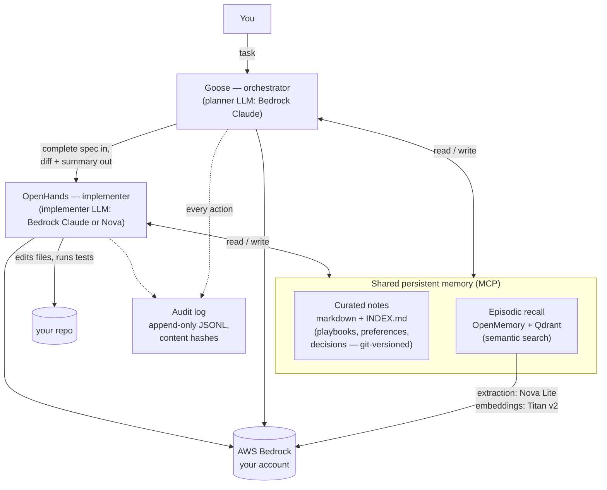

# Project Overview — What This Is and Why It's Different


This is a coding agent you run yourself, that **remembers**.

You give it a task ("make these tests pass", "add a flag to this CLI"). A
planner model reads what the system already knows — your preferences, past
decisions, step-by-step playbooks from earlier tasks — writes a precise spec,
and hands it to a second agent that edits the files and runs the tests in
your repo. When the work is done, the system writes down what it learned, in
plain markdown a human can open, edit, or delete. The next similar task
starts with that knowledge already loaded.

All model calls go to AWS Bedrock under **your own AWS account**. Your code
and prompts never touch any other company's service. There is no local GPU,
no model hosting, nothing to babysit: two small Docker containers and a CLI.

## Architecture



The task loop the orchestrator follows on every run:

**ORIENT** (read the memory index) → **RECALL** (search episodic memory) →
**PLAN** (write a self-contained spec) → **DELEGATE** (implementer executes,
returns a structured diff) → **REVIEW** (verify, retry or escalate) →
**LEARN** (save playbooks, decisions, preferences back to memory).

## What's implemented

| Component | What it does |
|---|---|
| `localagent` CLI | One-command lifecycle on macOS/Linux/Windows: `init` (configs + dependency check), `up` (memory stack), `goose-setup` (renders orchestrator config), `doctor` (end-to-end health check incl. a real Bedrock round trip), `report` (learning metrics), `demo-repo` (sample task repos), `autostart` |
| Delegation wrapper | OpenHands agent exposed as one MCP tool, `delegate_coding_task` — spec in, diff + summary out; flags empty diffs (a model claiming success without changes); hard iteration ceiling |
| Curated memory server | `save_note` / `read_note` / `get_memory_index` / `delete_note` over plain markdown files; every change git-committed automatically — full history of everything the agents have learned, instant rollback |
| Episodic memory stack | OpenMemory (mem0) + Qdrant in Docker, extraction and embeddings on Bedrock, browsable web UI at `localhost:3000` |
| Playbook flywheel | The orchestrator recipe writes a generalized playbook after novel tasks and passes matching playbooks into later delegations; playbooks are promoted (draft → trusted) or retired based on outcomes |
| Standing preferences | One file, injected into every session of *both* agents deterministically — never lost, never dependent on retrieval |
| Audit log | Append-only JSONL of every task and memory write — timestamps, content hashes (safe to ship to log systems without leaking source), durations, outcomes |
| Learning metrics | `localagent report`: delegation success rate, playbook hit rate, escalation rate per week — the curve that shows the system getting better |
| Sample repos | `localagent demo-repo textstats` / `csvstats` — small repos with failing tests; run one after the other to watch a playbook learned on the first get reused on the second |

## What makes it different

The honest comparison, as of mid-2026:

**GitHub Copilot** keeps its memory repo-scoped, expires it after 28 days,
and stores it on GitHub's servers; all inference runs on GitHub/Microsoft
infrastructure with no self-hosted option. **Claude Code** runs on Bedrock
and has per-developer memory, but that memory is machine-local by design —
it doesn't transfer between machines, developers, or repos — and its skills
are hand-written files, not learned.

This project occupies the spot neither of them covers:

1. **Memory that belongs to you, with no expiry.** Knowledge lives in plain
   files and a vector store on infrastructure you control, shared by every
   agent that mounts it, versioned in git forever. Nothing ages out after
   28 days; nothing is stranded on one laptop.
2. **It learns procedures, not just facts.** Other assistants remember
   "this repo uses pytest." This system writes *playbooks* — generalized,
   step-by-step procedures distilled from solved tasks — and feeds them to
   the implementer on the next similar task. The learning compounds, and
   `localagent report` measures it compounding.
3. **The learning is auditable.** Every memory is a readable markdown file
   with a git history; every agent action is a hash-chained log line. You
   can answer "what does my agent know, where did it learn it, and what did
   it do" — none of the hosted assistants can.
4. **Two models, one brain, your cost dial.** Plan with a frontier model,
   implement with a cheaper one (or the same one — one line in `.env`).
   Because both agents share the same memory, the cheap model inherits the
   expensive model's distilled experience. The better the playbook library
   gets, the less frontier-model time each task needs.
5. **One trust boundary.** Everything model-shaped happens in your AWS
   account under your IAM controls and Bedrock's no-training-on-customer-
   content terms; everything stateful stays on your machine, bound to
   localhost. For teams whose code cannot leave their boundary, this is the
   difference between "can't use AI coding tools" and "can."

## The need it fills

There are many excellent coding assistants and many teams that cannot use
them — because the code is regulated, contractual, or simply private, and
the assistants are hosted services with their own data planes. The usual
fallback is either nothing, or a weak air-gapped autocomplete.

This project is the third option: a real agentic system — planning,
delegation, persistent learning, measurable improvement — built entirely
from open-source components and your own AWS account. The impact compounds:
unlike a stateless assistant that solves the same problem fresh every time
for every developer, this one solves it once, writes it down, and gets
cheaper and faster at everything that resembles it.

## See it work

Five minutes, two commands, after the Quick start in the README:

```bash
localagent demo-repo textstats demo1    # run the printed command — watch
                                        # plan → delegate → tests pass → learn
localagent demo-repo csvstats demo2     # same category — watch the playbook
                                        # from demo1 get found and reused
cat ~/.local/share/agent-memory/INDEX.md   # what it knows now
localagent report                          # the improvement, measured
```
